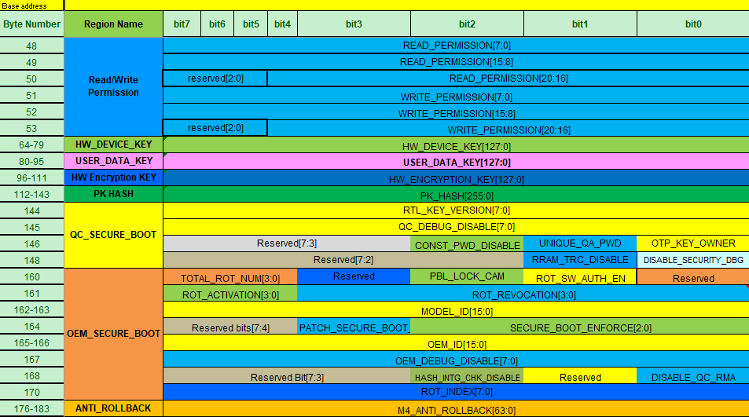
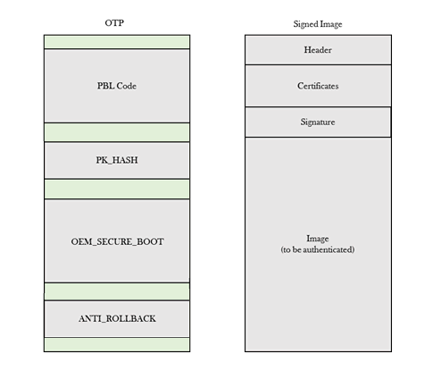

# 10 - QCC730 secure-boot reference (external)

[中文版](10-qcc730-secure-boot-reference.zh-CN.md)

This document holds external reference material from Qualcomm and OP-TEE. It is not about the `greatwhite` device. The QCC730 is a different Qualcomm part (M4F application processor, RRAM and flash). Its OTP layout and signing format are the best documented example of how Qualcomm encodes secure-boot and anti-rollback state. Use them as a model to test against the `greatwhite` evidence, not as a description of it.

## Sources

| Source | Revision | Used for |
|---|---|---|
| Qualcomm, *Enable Secure Boot on QCC730 Application Note*, 80-Y8730-8, rev AB, updated Feb 10, 2026. Four pages: *OTP format and configuration*, *SecImage configuration file*, *Secure boot key features on QCC730*, *Examples for secure boot configuration* | AB | Sections 1 to 4 below |
| OP-TEE documentation, *Hoya architecture* (`architecture/platforms/qualcomm/hoya.rst`), supplied by the user | current | Section 5 |

The Qualcomm pages were supplied by the user as saved HTML. Their figures are in `docs/images/qcc730/`. Each figure is a WebP image (the saved files were named `.png` but are WebP).

## 1. OTP format and configuration

QCC730 OTP fuses are zero before they are blown and one after. A field can be cleared back to zero until its region is locked.



*Figure: QCC730 OTP format for secure boot.*

### Read and write permissions

| Byte | Bit | Name | Meaning | Guidance |
|---|---|---|---|---|
| 48 | 4 | READ_PERMISSION_HW_ENCRYPTION_KEY | 1 disables software reads of the hardware encryption key | 1 |
| 51 | 2 | WRITE_PERMISSION_READ_WRITE_PEMRIONS | 1 disables software writes to the read/write permissions region | 1 |
| 4 | | WRITE_PERMISSION_HW_ENCRYPTION_KEY | 1 disables software writes to the hardware encryption key | 1 |
| 5 | | WRITE_PERMISSION_PK_HASH | 1 disables software writes to the RoT hash region | 1 |
| 7 | | WRITE_PERMISSION_OEM_SECURE_BOOT | 1 disables software writes to the OEM secure-boot region | 1 |
| 52 | 0 | WRITE_PERMISSION_ANTI_ROLL_BACK | 1 disables software writes to the anti-rollback region | 1 |

The document's table names the field `WRITE_PERMISSION_READ_WRITE_PEMRIONS`, with that spelling.

### Keys

| Bytes | Name | Meaning |
|---|---|---|
| 64-79 | HW_DEVICE_KEY | 128-bit device unique key, provisioned by Qualcomm, used by the KDF |
| 80-95 | USER_DATA_KEY | 128-bit random key used with the device key by the KDF for secure storage. Qualcomm provisions it and keeps no per-device tracking |
| 96-111 | HW_ENCRYPTION_KEY | 128-bit key common to multiple devices, used by the KDF |

### RoT hash

| Bytes | Name | Meaning |
|---|---|---|
| 112-143 | PK_HASH | SHA-256 of the root certificates used for image signing. Calculated over the number of root certificates given by TOTAL_ROT_NUM |

### OEM secure boot

| Byte | Bit | Name | Meaning | Guidance |
|---|---|---|---|---|
| 160 | 7:4 | TOTAL_ROT_NUM[3:0] | Number of RoTs used for the RoT hash. QCC730 supports only one | 1 |
| 162-163 | | MODEL_ID | Model identifier | |
| 164 | 2:0 | SECURE_BOOT_ENFORCE[2:0] | 0x7 enables enforcement: image authentication and the anti-rollback check | 7 |
| 165-166 | | OEM_ID | 16-bit identifier issued by Qualcomm, used by image authentication | Blow the assigned value |
| 167 | 7 | OEM_DEBUG_DISABLE | 1 disables JTAG debugging | 1 |
| 168 | 2 | HASH_INTG_CHK_DISABLE | 1 disables hash integrity checking when enforcement is off | 0 |
| 0 | | DISABLE_QC_RMA | 1 disables the QC RMA password that enables hardware debug | 0 |

### Anti-rollback

| Byte | Bit | Name | Meaning |
|---|---|---|---|
| 176 | 7:0 | ANTI_ROLLBACK[7:0] | The **sum of the one bits** in the field is the minimum anti-rollback image version that secure boot allows to run |
| 177 | 7:0 | ANTI_ROLLBACK[15:8] | |
| 178 | 7:0 | ANTI_ROLLBACK[23:16] | |
| 179 | 7:0 | ANTI_ROLLBACK[31:24] | |
| 180 | 7:0 | ANTI_ROLLBACK[39:32] | |
| 181 | 7:0 | ANTI_ROLLBACK[47:40] | |
| 182 | 7:0 | ANTI_ROLLBACK[55:48] | |
| 183 | 7:0 | ANTI_ROLLBACK[63:56] | |

The document defines the version as the sum of one bits. This is a thermometer-style encoding (the sum counts the set bits). Its exact fuse-write rules are in the programming guide, not in this material.

### Fuse blowing

The NVM programmer (`nvm_programmer.py`) reads and writes QCC730 OTP, RRAM and flash. The programming guide is QCC730.FR.1.0 (80-Y8730-2), which is not in the supplied material.

## 2. SecImage configuration file

The SecImage configuration (`qcc730_secimage.xml`) signs, post-processes and validates secure images. It has four sections: `metadata`, `general_properties`, `data_provisioning` and `image_list`.

- `metadata`: `<chipset>qcc730</chipset>`, `<version>2.0</version>`.
- `general_properties`: `selected_signer` (local, default), `selected_cert_config`, `cass_capability` (`secboot_sha2_root`, a SHA-256-signed root certificate), `key_size` (2048), `exponent` (257 or 65537), `mrc_index`, `num_root_certs`, `msm_part`, `oem_id`, `model_id`, `debug`, `max_cert_size`, `num_certs_in_certchain`.
- `image_list`: each image has `sign_id`, `name`, `image_type` (`elf_has_ht`) and a `sw_id` override.

The local signer uses the Qualcomm platform signing application (QPSA) test PKI. For a local pre-signed certificate, create a one-word folder under `sectools\resources\data_prov_assets\Signing\Local\` and name it in `selected_cert_config`. Its `config.xml` sets `is_mrc`, `root_pre`, `attest_ca_pre`, `attest_pre`, `root_cert` and `root_private_key`.

### Certificate OU fields

| OU field | Bits | Layout |
|---|---|---|
| SW_ID | 64 | 32 MSB: anti-rollback version. 32 LSB: image ID (software type). The image version is compared with the anti-rollback OTP |
| HW_ID | 64 | 32 MSB: hardware SoC version. 16 bits: OEM_ID. 16 LSB: MODEL_ID |
| DEBUG | 64 | 32 MSB: lower 32 bits of the chip serial number. 32 LSB: debug vector |
| OEM_ID | 16 | Default 0x0000 |
| MODEL_ID | 16 | Default 0x0000 |

**SW_ID software type** (32 LSB): `FERMION_SBL = 0x00` (SBL image), `FERMION_APP = 0x01` (APP image). The golden images use `sbl_golden` = 0x02 and `app_golden` = 0x03 in the example image list.

**Example.** `<sw_id>0x0000000100000000</sw_id>` sets software version 0x01 for the SBL image with the anti-rollback check.

**HW_ID** uses `in_use_soc_hw_version` = 1 to take the SoC version in the upper 32 bits. OEM_ID and MODEL_ID are compared against the same fields in OTP.

**DEBUG** overrides the OEM debug-disable OTPs. Commercial images use zero. A debug flag of `0x2` writes 0 to the one-time debug override registers. A flag of `0x3` writes 1 only when the serial number in the upper 32 bits matches the chip. For example, `0x1234567800000003` is a debug certificate for serial `0x12345678`. If the field is missing, the default `0x0000000000000000` is used.

## 3. Secure boot key features

QCC730 authenticates firmware loaded from RRAM or external flash for the M4F. The features are:
- two separately signed images, SBL and APP;
- SHA-256 hashing;
- RSA 2048-bit signatures;
- JTAG debug overrides;
- anti-rollback.

**Signing.** Sectools generates a certificate for the firmware image. The certificate holds the public key and a digest of the whole image, along with the OEM ID and model ID burned into OTP. Sectools signs the certificate with the private key.

**Authentication at reset.**
1. Validate the certificate chain embedded in the image.
2. Compare the image digest stored in the certificate with a digest the ROM computes.
3. Root certificates are checked by hashing them with SHA-256 and comparing with the hash in OTP (PK_HASH).

**Boot chain.** Power on, then PBL (in ROM) loads and authenticates SBL, SBL loads and authenticates APP, and APP runs.


*Figure: Secure boot flowchart on QCC730.*



*Figure: Image authentication components. Secure-boot data is held in OTP, RRAM and flash.*

## 4. Examples for secure boot configuration

**Single root certificate.** The `qcc730_secimage.xml` general properties are `cass_capability` = `secboot_sha2_root`, `key_size` = 2048, `exponent` = 257, `num_root_certs` = 1, `oem_id` = 0x0000, `model_id` = 0x0000, `debug` = 0x2, `num_certs_in_certchain` = 2.

**Enable secure boot in OTP.**
```
python nvm_programmer.py -n otp -k SECURE_BOOT_ENFORCE=0x7 -s ch347
python nvm_programmer.py -n otp -k TOTAL_ROT_NUM=0x1 -s ch347
python nvm_programmer.py -n otp -k PK_HASH=<SHA-256 of the root certificate> -s ch347
```
The example SHA-256 of `qpsa_rootca.cer` is `de5480d49ed1cbe0813755f06324fce56e3eb391a9a40ffba8df9fd16c717744`. The value is read from `sha256rootcert.txt` in the local certificate folder.

**Disable JTAG.** `python nvm_programmer.py -n otp -k OEM_DEBUG_DISABLE=0x80 -s ch347`. To re-enable it, set the debug field to `0x...03` in `qcc730_secimage.xml`, for the matching serial number (see DEBUG above).

**Raise the anti-rollback version.** The example sets `sw_id` to `0x0000000100000000` for SBL and `0x0000000100000001` for APP, so both images carry software version 1. The example shows only the SecImage side. The matching OTP write is not in the supplied material.

## 5. OP-TEE documentation: Hoya architecture (supplied by the user)

The Hoya family targets Qualcomm application processors, currently `kodiak` and `lemans`. On top of the common Qualcomm platform features it enables an 8-core Cortex-A (ARMv8) configuration with a GICv3 interrupt controller (`CFG_ARM_GICV3`).

**Drivers and services:**
- RAMBLUR inline memory protection, v3 (`CFG_QCOM_RAMBLUR_PIMEM_V3`), giving anti-rollback, integrity and confidentiality protection for secure memory windows.
- Secure RNG, `CFG_QCOM_CSRNG`, the entropy source for `hw_get_random_bytes()`.
- Qualcomm clock driver, `CFG_DRIVERS_QCOM_CLK`, on the OP-TEE clock framework.
- QFPROM (`CFG_QCOM_QFPROM`) for reading OTP fuses. Boot provisioning is controlled by `CFG_QCOM_QFPROM_FUSEPROV`.
- Peripheral Authentication Service, PAS (`CFG_QCOM_PAS_PTA`), which authenticates and starts remote subsystem firmware.

QFPROM supplies fuse-backed authentication data and supports boot-time provisioning. Both Kodiak and Lemans use Command DB to find shared power resources and RPMh to request programming supplies. Kodiak also needs an MX-rail vote coordinated with the Always-On Processor (AOP).

| Chipset | Signature authentication | Hardware Unique Key |
|---|---|---|
| Kodiak | Not enabled | Default test key |
| Lemans | Supported | Hardware (HWKM) |

**Kodiak.** PAS brings up the audio DSP (LPASS/QDSP6), the compute DSP (Turing), the video codec (IRIS) and WPSS, without certificate-based signature authentication. Boot provisioning defaults to enabled on secure builds (not `CFG_INSECURE`) and enables QFPROM. There is no PAS fuse-read service enabled by default.

**Lemans.** PAS brings up the audio DSP, two Turing compute DSPs, two GPDSPs, IRIS and the camera subsystems. Certificate-based signature authentication is enabled (`CFG_QCOM_PAS_AUTH`), backed by a restricted fuse-read service (`CFG_QCOM_FUSE_PTA`). With that enabled, certificate and signature checks are skipped only when the secure-boot fuses say secure boot is off. Firmware segment hashes are still checked. Its hardware unique key comes from the Hardware Key Manager (`CFG_QCOM_HWKM`).

QFPROM is enabled for either boot provisioning or the PAS fuse-read service. Boot provisioning defaults to enabled on secure builds, and the PAS fuse-read path can enable QFPROM on insecure builds.

## 6. Comparison with the greatwhite evidence (hypotheses, not findings)

These are parallels to test. None is confirmed on `greatwhite`.

| QCC730 concept | greatwhite evidence (see docs 02, 03, 06) | Status |
|---|---|---|
| Anti-rollback as a 64-bit thermometer code in OTP | Software-fuse ranges `FUSE_CONTROLLER_SW_RANGE0`-`5` in the UEFI fuse library. `0x221C` block (doc 06) | Hypothesis: the rollback banks are SW ranges with a thermometer layout |
| Image SW_ID type field (SBL, APP, golden) | Hypervisor `PILSubsys_getArbFuseBank` gives a per-subsystem arb fuse bank (doc 06) | Hypothesis: a per-subsystem index into the same kind of bank |
| PK_HASH, SHA-256 of root certificates | `OEM_rot_pk_hash1_fuse_values` in TZ and devcfg (doc 06) | Hypothesis: the same role; the reader is still not found |
| SECURE_BOOT_ENFORCE and the enable bits | Secure-boot status word, bits 0 to 11, bit 3 = anti-rollback (doc 06) | Structural parallel; the status service is not identified |
| Debug override and DEBUG field | Secure-debug fuse checks, bits 8 to 11 (doc 06) | Structural parallel |
| Read/write permission bits for fuse regions | `FUSE_CONTROLLER` and `QFPROM_CORR` regions (doc 06) | Not compared yet |

The QCC730 layout cannot be applied to `greatwhite` without checking. It is a different chip, and the OTP byte offsets above are its own.
